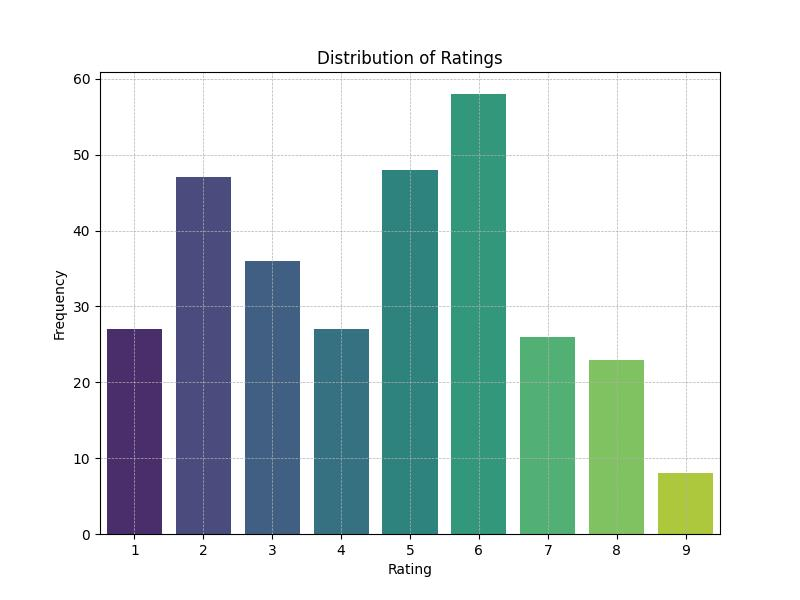
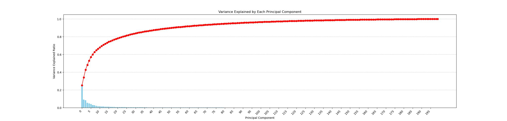
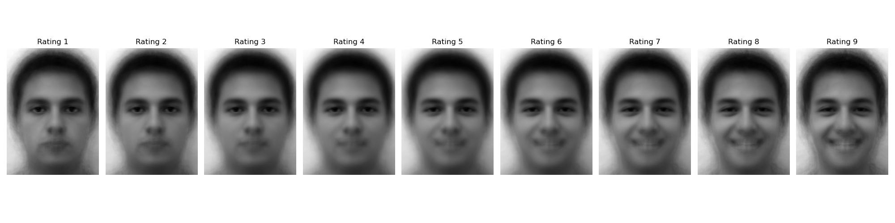

# 02458 Cognitive Modelling
## Linear Encoding to generate synthetic face images

### Authors
- Ting-Hui Cheng (s232855)

### Install packages
pip install -r requirements.txt

### Files and Results
rating.py: A code that can run experiments to show image and generate data based on users clicks

rating_distirbution.py: Plot the distribution of rating in data using a histogram

PCA.py: Based on the data collected, visualize the first few PCA components as images and explained variance ratio/cumulative variance

feature_selection.py: Fit PCA with data, use forward selection to choose important feature, and generate synthetic face images. 

